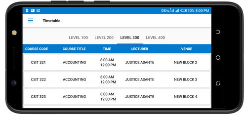

<!DOCTYPE html>
<html  lang="en">
    <head>
        <meta charset="UTF-8">
        <meta name="viewport" content="width=device-width, initial-scale=1.0">
        <meta http-equiv="X-UA-Compatible" content="ie=edge">
        
        <link href="https://fonts.googleapis.com/css?family=Montserrat|Open+Sans+Condensed:300|Oswald|Roboto&display=swap" rel="stylesheet">
                
        <link href="https://fonts.googleapis.com/css?family=Open+Sans:400,600,700" rel="stylesheet">
        <link rel="icon" type="image/icon" href="images/logoo.png" />
        <title>DNB</title>
        <link href="css/homepage.css" rel="stylesheet" type="text/css">
    </head>
    <body>
        

                

                        <header>
                             
 

                             <i class="fa fa-bars menu-toggle" ></i>
                             <Ul class="nav">
                             <li><a href="https://play.google.com/store/apps/details?id=com.i_project.dnb"> Download</a></li> 
                             <li><a href="privacy.html"> Privacy Policy</a></li> 
                              <li><a href="terms.html"> Terms and Conditions</a></li>

                             
                            
                   
                        </header>
                

                    

                        <section class="timetable-section">
                            

                                

                                        <h1 class="dnb">Digital Notice Board</h1>
                                

                                

                                        DNB Application is an interactive smart phone and tablet Application for providing organisations with
                                        real time information that is accurate, Structured and updated. With initial focus on University of Ghana
                                        students, it provides real time and useful academic information on the go. DNB currently operate on the 
                                        android platform with fast, precise and simple to use interface. First of it's kind - it provides relevant
                                        information about important schedules and resources to it's users. DNB aims at promoting punctuality, 
                                        educating students and enhance collaboration among organisations effectively.
                                

                            

                            

                                
                            

                            

                                
                            

                        
                        </section>
                        
                       
                            
                     

                        

                            

                                <h3 class="footer-heading">Quick links</h3>
                                <ul class="link">
                                    <li><a href="">Download</a></li>
                                    <li><a href=""> Privacy Policy</a></li> 
                                    <li><a href="#"> Terms and Conditions</a></li>
                                </ul>
                            

                            

                            

                                <h3 class="footer-heading">Platforms</h3>
                                <ul class="link">
                                    <li><a href="#">Android</a></li>
                                </ul>
                            

                           

                            

                                <h3 class="footer-heading">Devices</h3>
                                <ul class="link">
                                    <li><a href="#">Smart phones</a></li>
                                    <li><a href="#">Tablets</a></li>
    
                                </ul>
                            

                           
                        

                        <footer class="bottom-footer">
                            
&copy; 2020 DNB-All Rights Reserved  

                           
                        </footer>
        

       

        
    </body>
</html>
